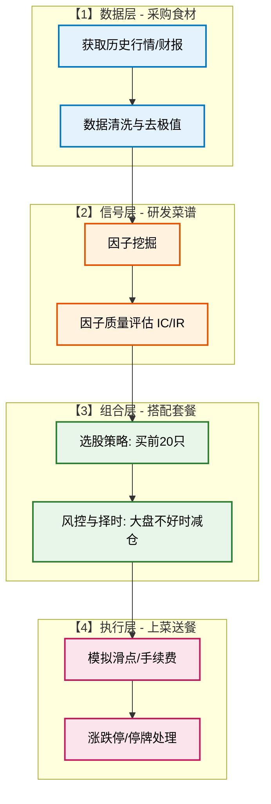
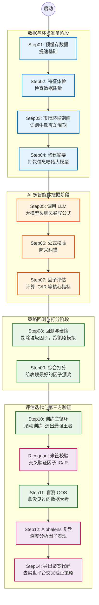

# 第 1 篇：导论篇 —— 量化基础与系统全貌

## 课程简介

欢迎来到**《AI 量化投资：从小白到“因子工厂”厂长》**系列教程的第一篇！

如果你对股票市场充满好奇，却又常常被各种复杂的代码、数学公式和“高大上”的金融词汇劝退，那么这个系列教程正是为你准备的。我们将带你从零开始，理解量化投资的基础逻辑，并深入拆解本项目的核心架构——一个**完全基于大模型（LLM）驱动的全自动量化因子挖掘系统**。

---

## 1.1 量化投资是什么？

提到炒股，你脑海中浮现出的画面可能是：一位经验丰富的老股民，盯着红绿交错的 K 线图，看着新闻，凭借着多年积累的“盘感”大喊一声：“买入！”

这叫做**主观投资**。它的核心是“人”。

而**量化投资**，则是把那些能让人赚钱的“经验”、“规律”和“直觉”，翻译成计算机能看懂的**数学模型和代码逻辑**。然后，让计算机像一个没有感情的机器一样，不知疲倦地去市场里寻找赚钱的机会。

### 主观投资 vs. 量化投资

| 维度 | 主观投资 | 量化投资 |
| :--- | :--- | :--- |
| **决策依据** | 个人经验、直觉、深度调研、小道消息 | 历史数据、统计学规律、数学模型 |
| **执行纪律** | 容易受情绪波动影响（贪婪与恐惧） | 铁血执行，没有感情的下单机器 |
| **覆盖广度** | 精力有限，通常只能深入跟踪几只或几十只股票 | 算力无限，可同时监控全市场 5000+ 只股票 |
| **试错成本** | 需要真金白银去市场里“交学费”积累经验 | 可以通过“历史回测”在过去 10 年的数据中无损试错 |

**关键认知**：量化投资并不是拥有“稳赚不赔”的魔法，而是依靠**概率**和**纪律**取胜。只要我们发现一个胜率是 55% 的规律，并坚持重复一万次，复利的力量就能带来惊人的收益。

### “量化”到底在量化什么？

想要让计算机找规律，我们首先要喂给它数据。量化投资通常量化以下几类数据：
1. **量价数据（Price & Volume）**：开盘价、收盘价、最高价、最低价、成交量等（这是本项目最核心的数据源）。
2. **基本面数据（Fundamentals）**：财报里的净利润、营业收入、市盈率（PE）、市净率（PB）等。
3. **另类数据（Alternative Data）**：新闻情绪、社交媒体讨论热度、甚至卫星拍摄的停车场车位数量。

---

## 1.2 主流的量化策略与流派

量化投资是一门大学问，里面有很多门派。我们主要了解以下三种，并认准我们本项目的“主攻方向”：

1. **多因子选股（Alpha 策略）** 👈 **我们的主战场！**
   - **原理**：就像给股票做“体检打分”。我们找出很多个能预测股票上涨的指标（称为“因子”），比如“近期涨得猛的股票还会继续涨”（动量因子），或者“市盈率低的股票容易被低估”（价值因子）。把这些因子综合起来给全市场的股票打分，买入分数最高的，卖出分数最低的。
2. **管理期货（CTA）**
   - **原理**：主要针对期货市场，寻找商品价格的趋势。常说的“追涨杀跌”就是最经典的趋势跟踪 CTA。
3. **高频交易（HFT）**
   - **原理**：天下武功唯快不破。利用极高的网速和计算机硬件，在几毫秒甚至微秒内捕捉微小的价差套利。这对个人投资者来说门槛极高。

---

## 1.3 搭建一个量化系统需要哪些核心模块？

如果把量化系统比作一家“餐厅”，它通常需要四个核心厨房部门协同工作。通过下方的架构图，我们可以清晰地看到这四个模块：

---

## 1.4 本项目全貌：全自动 AI 因子挖掘系统

传统的量化团队中，“信号层（挖掘因子）”是最苦最累的活。研究员们（俗称“量化矿工”）需要天天看论文、敲代码、做实验，绞尽脑汁地想出新的数学公式。

**而我们的项目，最大的亮点就是：让大模型（LLM）代替人类，成为不知疲倦的“量化矿工”！**

本项目是一个完整的端到端流水线（Pipeline），从获取数据到最终在实盘平台（聚宽）上验证，全流程自动化。

### 系统运行流水线（Pipeline）全景图

让我们用一张流程图，总览项目中 `Step01` 到 `Step14` 到底在干什么：

### 大模型在本项目中的核心角色

传统量化依靠人脑的“灵光一闪”，或者计算机的“暴力穷举”（Genetic Programming）。
本项目则引入了 **LLM 多智能体架构（Multi-Agent）**：
- 并不是简单地问大模型：“给我一个炒股公式”。
- 而是组建了一个**虚拟的分析师团队**（在 `Step05` 中发生）：
  1. **专业分析师团队**：分别研究动量、量价、微观结构等领域。
  2. **首席分析师**：汇总大家的点子，给出研发方向。
  3. **因子生成器**：严格按照代码规范，写出真实的数学公式。
  4. **评审员**：挑刺、找 BUG，不合格的打回重写。

通过这种方式，大模型可以源源不断地为你生产出具有“逻辑可解释性”的选股因子。

---

### 小结

在这一篇中，我们了解了量化投资的基础知识，并鸟瞰了本项目的全貌。它不仅是一个因子挖掘工具，更是一条标准的量化流水线。

在下一篇**《第 2 篇：数据源与股票池篇》**中，我们将正式深入代码与配置，教你如何为系统接入数据源（Tushare）、理解强大的缓存机制，并配置你的“狩猎场”——股票池。我们下节见！
