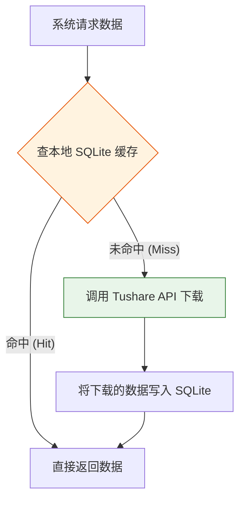

# 第 2 篇：数据源与股票池篇 —— 寻找优质的“矿脉”

## 课程简介

在上一篇中，我们了解了量化投资的基础知识和本项目的全貌。今天，我们将正式走进“数据层”。

如果把量化选股比作“挖矿”，那么**数据源**就是提供原石的矿区，而**股票池**则决定了你要去哪座山上挖。这一篇，我们将带你读懂项目中的 `env.yaml` 和 `analysis_rule.yaml`，学会配置数据源和筛选股票池。

---

## 2.1 数据源与本地缓存机制

### 我们需要什么样的数据？

要让大模型帮我们写因子公式，我们首先得有“基础特征”。本项目主要依赖两种数据：
1. **日线行情数据（Daily）**：包括开盘价、收盘价、最高价、最低价、成交量等。
2. **基础衍生数据（Daily Basic）**：如总市值、流通市值、换手率等。

目前，本项目统一使用 **Tushare** 作为唯一数据源（一种非常普及的金融数据接口）。

### Tushare 接入配置

在 `runtime/config/env.yaml` 中，有一段专门配置 Tushare 的参数：

```yaml
# env.yaml
data_source: tushare
freq: day  # 数据频率，'day' 表示日线数据

tushare:
  # Tushare API Key，需要去 Tushare 官网注册获取
  api_key: your_api_key_here
  # 本地数据缓存目录
  data_cache_dir: D:/test/factor-factory/runtime/data/tushare_cache
  # 占位符过期天数
  placeholder_expire_days: 3
```

> ⚠️ **新手避坑**：如果 `data_source` 不是 `tushare`，或者 `api_key` 填错了，系统一启动就会直接报错罢工！

### SQLite 本地缓存：为什么系统能越跑越快？

如果你频繁调用 Tushare 接口下载几年、几千只股票的数据，很容易触发**接口限流**。为了解决这个痛点，本项目设计了一个非常巧妙的**本地 SQLite 缓存机制**。

它的工作原理如下：



**缓存机制的优势：**
- **第一次跑**（比如执行 `Step01_precache_tushare.py` 时）：系统会疯狂调用 Tushare 下载数据，过程可能比较慢。
- **第二次及以后跑**：绝大部分数据都在本地缓存中命中了，速度会快得飞起！这就叫“前人栽树，后人乘凉”。

---

## 2.2 股票池：决定你能在哪里赚钱

“股票池”（Stock Pool）是指你在回测或实盘时，**允许系统买卖的股票范围**。

### 为什么要限制股票池？

1. **规避风险**：我们通常不碰 ST 股（随时可能退市）和次新股（上市时间太短，数据不稳，容易暴涨暴跌）。
2. **贴近实盘**：机构做量化，很少在全市场 5000 多只股票里乱买。通常会圈定一个范围，比如只买“沪深300”或“中证500”里的股票，这样流动性好，大资金进出容易。

### 系统支持的股票池模式

本项目通过 `runtime/config/env.yaml` 或 `analysis_rule.yaml` 中的 `stock_pool` 模块来配置股票池。系统内置了 6 种强大的模式：

| 股票池类型 (`type`) | 说明 | 适用场景 |
| :--- | :--- | :--- |
| `index_components` | **指数成分股**（如沪深300） | 🌟 **最推荐**，贴近实盘，风格控制得好。 |
| `all_market` | **全市场** | 暴力挖掘全局因子时使用。 |
| `industry` | **特定行业**（如银行、医药） | 研究行业内轮动策略。 |
| `custom_list` | **自定义列表** | 手动指定几只股票（如自选股）。 |
| `random_sample` | **随机抽样** | 🚀 **开发调试最爱**。随机抽 100 只股，跑得快！ |
| `stratified_sample` | **分层抽样** | 既想缩小数据量，又想保持市值/行业的代表性。 |

### 配置实战：手把手教你配股票池

让我们来看看几种常见的 YAML 配置写法：

#### 场景 1：我只想跑个 Demo 试试系统通不通（随机抽 100 只）

```yaml
stock_pool:
  type: "random_sample"
  base_pool_type: "all_market"
  sample_size: 100
  seed: 42  # 固定种子，保证每次抽出来的 100 只是一样的
```

#### 场景 2：我要做严肃的沪深 300 因子挖掘（剔除 ST 和新股）

```yaml
stock_pool:
  type: index_components
  index_code: SH000300  # 沪深300。中证500是 SH000905
  # 动态成分股：这非常关键！指数成分股每年都在调，设为 true 表示系统会穿越回过去，用当时的真实成分股。
  dynamic_membership: true
  include_st: false        # 不要 ST 股
  include_new_stock: false # 不要次新股
  new_stock_days: 60       # 上市不满 60 天的算次新股
  # 为避免查动态成分股时 API 爆炸，设置回溯缓存天数
  index_component_search_max_open_days: 2000
```

### 深入理解：什么是 `dynamic_membership: true`？

想象一下，你现在回测 2020 年的策略。如果你用**今天**的沪深300名单去测 2020 年，那叫**“未来函数”**（因为你提前知道了哪些股票后来会牛到被选入沪深300）。

当 `dynamic_membership: true` 时，系统会像时光机一样，每天去查询“在回测当天的那个横截面上，沪深300的成分股到底是谁”。这能确保你的回测结果在实盘平台（如聚宽、米筐）上能够严丝合缝地对齐！

---

### 小结

在这一篇中，我们搞懂了系统是如何通过 Tushare + SQLite 缓存来高效获取数据的，并且学会了如何通过修改 `YAML` 文件来定制我们的股票池。

拿到了原石（数据），接下来该怎么办呢？在下一篇**《第 3 篇：数据预处理与标签篇》**中，我们将学习如何清洗这些数据（去极值、中性化），以及如何定义大模型学习的“目标”（收益标签）。我们下节见！
