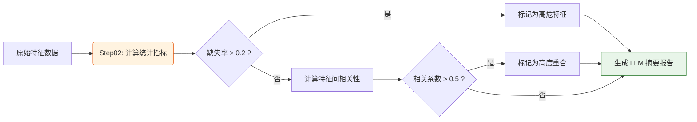

# 第 3 篇：数据预处理与标签篇 —— 炼丹前的“洗菜切菜”

## 课程简介

在上一篇中，我们成功把数据从 Tushare 矿区搬到了本地缓存，并圈定了我们想要操作的“股票池”。

拿到这些“生鲜食材”后，能直接下锅炒吗？当然不行！金融数据里充满了“泥沙”——缺失值、极端值、或者是被大盘股和特定行业扭曲的偏差。

本篇我们将深入项目中的 `Step02_health_check.py` 以及 `analysis_rule.yaml` 中的 `preprocess` 和 `label` 模块，看看我们是如何在“炼丹”前进行“洗菜切菜”的。

---

## 3.1 特征体检：如何判断数据能不能用？

在我们让大模型（LLM）用基础特征（如 `close`, `volume`, `pe`）写公式之前，我们必须先对这些特征做一次全面的体检。这就是流水线中 **Step02** 的任务。

### 为什么要做特征体检？

1. **缺失值太多**：如果某个指标（比如某项冷门财报数据）在 80% 的股票上都没有数据，那大模型用它写出来的因子一定是个“废品”。
2. **相关性太高**：如果大模型写了两个因子，本质上都是在表达“动量”，它们的相关性高达 0.95，这就造成了资源浪费。我们需要把这些情况反馈给大模型，让它“换个思路”。

### 体检报告的 YAML 配置

在 `runtime/config/env.yaml` 中，我们配置了如何生成这份“体检报告（摘要）”喂给大模型：

```yaml
# env.yaml
# 生成健康检查摘要时，分别挑选几个“最强”和“最弱”的特征给大模型看
summary_top_k: 3
# 挑选几个“最不稳定”的特征给大模型看
unstable_top_k: 3
# 判断两个特征是否“高度重合”的相关系数绝对值阈值
high_corr_threshold: 0.5
# 特征缺失率阈值（超过 20% 的特征会被标记并提示大模型谨慎使用）
max_missing_ratio: 0.2
```

**运作流程图：**



---

## 3.2 去极值与中性化处理

经过体检后，我们需要对数据进行标准化处理，这就涉及量化中非常经典的两个概念：**去极值**和**中性化**。

在 `runtime/config/analysis_rule.yaml` 中，这部分由 `preprocess` 模块控制：

```yaml
# analysis_rule.yaml
preprocess:
  # 1. 离群值处理 (去极值)
  outlier_method: mad  # 可选: none, mad, quantile, sigma
  outlier_options:
    n: 3.0  # MAD / 3sigma 使用的倍数阈值
    lower_quantile: 0.01  # 分位法使用的下边界
    upper_quantile: 0.99  # 分位法使用的上边界
    
  # 2. 中性化处理
  neutralization: industry_market_cap  # 可选: none, industry, market_cap, industry_market_cap
  neutralization_options:
    industry_field: industry
    market_cap_field: market_cap
```

### 什么是去极值（Outlier Processing）？

**原理**：金融市场偶尔会出现极其离谱的数据（比如某只股票一天换手率 80%，或者市盈率 10000 倍）。如果不处理，这些极端值会把整个统计模型“带偏”。

**主流方法**：
- **MAD（绝对中位差）**：最抗干扰的方法，以中位数为基准，把偏离中位数太远的值“拉回来”。本项目默认推荐！
- **3Sigma**：基于正态分布的去极值，把超出 3 个标准差的值砍掉。
- **Quantile（分位法）**：简单粗暴，把排在最前面 1% 和最后面 1% 的数值，强制替换为 1% 和 99% 的边界值（这叫 Winsorize 缩尾处理）。

### 什么是中性化（Neutralization）？

**原理**：假设你发明了一个“低市盈率选股因子”。你一跑结果，发现选出来的全是“银行股”和“钢铁股”，因为这些传统行业的市盈率天然就比科技股低。又或者，你发现选出来的全是“大盘股”。
为了证明你的因子**是真的有选股能力，而不是单纯在赌“行业”或“大小盘”**，我们需要剥离掉这些天然属性。

**主流方法**：
- **行业中性化（industry）**：让因子在每个行业内部去比较（在银行里选最好的银行，在科技里选最好的科技）。
- **市值中性化（market_cap）**：通过线性回归，剔除掉市值大小对因子得分的影响。
- **行业市值双重中性化（industry_market_cap）**：量化机构的标准操作，同时剥离两者。

> 💡 **提示**：本项目在设计上非常严谨。处理顺序固定为：**先去极值 -> 再中性化**。

---

## 3.3 价格复权与收益标签（Label）的定义

数据洗干净了，特征也处理好了，大模型要怎么知道它发明的因子是“好”还是“坏”呢？这就需要我们定义一个“目标靶子”，在机器学习里这叫 **Label（标签）**。

在量化选股中，标签通常就是**未来一段时间的收益率**。

### 价格复权（Price Adjust）

计算收益率前，必须搞懂“复权”。A 股经常有“10送10”、“分红派息”的操作。如果不复权，除权当天的股价会在 K 线图上呈现“腰斩”的假象，导致收益率计算完全错误！

```yaml
# analysis_rule.yaml
price_adjust: pre  # 可选: none(不复权), pre(前复权), post(后复权)
price_adjust_reference_date: auto
```
- **前复权（pre）**：以今天的价格为准，把历史价格往下调。（回测和因子计算最常用，本项目默认）。
- **后复权（post）**：以股票上市第一天的价格为准，把后来的价格往上调。

### 收益标签配置

我们希望大模型预测未来多长时间的收益？这由调仓频率决定：

```yaml
# analysis_rule.yaml
# 【调仓节奏】
rebalance: weekly  # 可选: daily / weekly / monthly
rebalance_interval: 1  # 1表示每1周调仓一次
rebalance_anchor: first_trading_day_of_week  # 每周第一个交易日调仓

# 【收益标签】
label:
  name: rebalance_period_return
  return_type: period_return
  price_field: close
```

**这段配置的业务含义是：**
系统会按周（`weekly`）的第一个交易日（`first_trading_day_of_week`）作为横截面。
如果今天是周一，大模型生成的因子打出了分数。那么标签（Label）就是：**从今天（周一）的收盘价（`close`），到下周一的收盘价之间，这只股票真实的涨跌幅（`period_return`）**。

因子分数如果能和这个未来收益率高度正相关（或负相关），那就说明大模型挖到了一个好因子！

---

### 小结

在这一篇中，我们掌握了量化数据处理的“三板斧”：
1. **特征体检**：剔除缺失值、高相关特征。
2. **预处理**：用 MAD 去极值，用行业/市值中性化剥离偏差。
3. **标签定义**：通过前复权价格，设定基于调仓周期的未来收益率靶子。

到目前为止，我们的食材已经完全准备就绪了！
但在把数据喂给大模型写公式之前，我们还需要告诉大模型现在的**“市场大环境”**是牛市还是熊市。在下一篇**《第 4 篇：市场环境刻画篇》**中，我们将看看系统是如何给市场“把脉”的！
