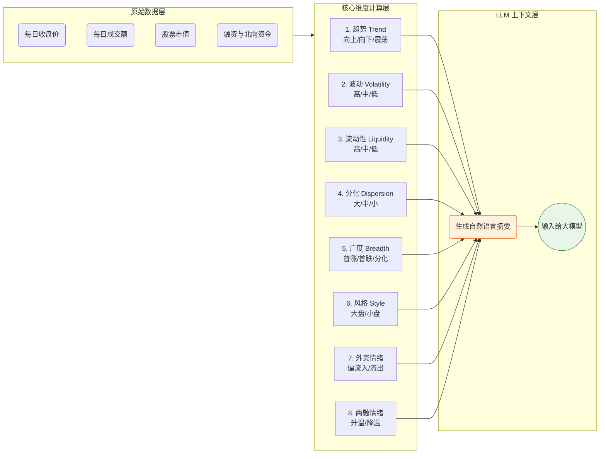

# 第 4 篇：市场环境刻画篇 —— 给大模型一双“看懂周期”的眼睛

## 课程简介

在金融市场里，有一句名言：“**没有永远有效的因子，只有适应当前环境的因子。**”
在牛市里闭着眼睛买“高动量”（涨得猛）的股票能赚大钱，但到了熊市，高动量往往会变成“高位接盘”，反而是“低估值、高股息”的防守型因子更有效。

如果我们只是把生硬的数据扔给大模型，让它“盲写”公式，它很可能会写出一个“只适合昨天，不适合明天”的策略。
本篇我们将解析 `Step03` 和 `runtime/config/market_context.yaml`，看看系统是如何给市场“把脉”，并生成一份生动的“市场体检报告”喂给大模型的。

---

## 4.1 市场环境的 8 大维度

本项目独创了 8 个维度的市场画像系统。系统不是拍脑袋下结论，而是每天计算底层的连续数值，然后翻译成大模型（人类）能看懂的“自然语言标签”。



---

## 4.2 核心配置文件解析：`market_context.yaml`

这份文件分成了两个极其重要的部分：**窗口参数（windows）** 和 **标签阈值（thresholds）**。
- **windows** 决定了“怎么算指标”。
- **thresholds** 决定了“算出来以后怎么贴标签”。

### 1. 趋势维度（Trend）

趋势代表了市场整体最近是在往哪边走。

```yaml
windows:
  trend_days: 20  # 计算过去20个交易日的累计涨跌幅

thresholds:
  trend_up: 0.03    # 过去20天累计涨幅 >= 3%，视为“上行”
  trend_down: -0.03 # 过去20天累计跌幅 <= -3%，视为“下行”
```
**翻译逻辑**：如果 `[20天收益] > 0.03`，系统会告诉大模型：“当前处于上行趋势，建议挖掘动量追涨类因子。”

### 2. 流动性（Liquidity）与波动（Volatility）

流动性代表钱多不多，波动代表市场稳不稳。系统使用了一种非常聪明的**历史分位法**。

```yaml
windows:
  volatility_days: 20       # 计算最近20天的波动率
  rank_lookback_days: 250   # 把它放到过去 250 天（约一年）里去排个名！

thresholds:
  rank_high: 0.67  # 排名超过历史上 67% 的日子，叫“高”
  rank_low: 0.33   # 排名低于历史上 33% 的日子，叫“低”
```
**翻译逻辑**：如果今天的成交额放到过去一年里，击败了 80% 的日子，系统就会贴上“流动性高”的标签。大模型看到后，可能就会偏向生成“量价齐升”的短线因子。

### 3. 分化（Dispersion）与广度（Breadth）

- **分化**：同一天里，涨幅第一的股票和跌幅第一的股票差别有多大？分化越大，说明“选错股的代价极大”。
- **广度**：普涨还是普跌？

```yaml
thresholds:
  breadth_risk_on: 0.62   # 每天平均有 62% 以上的股票都在涨，叫“普涨/风险偏好强”
  breadth_risk_off: 0.38  # 每天平均只有不到 38% 的股票在涨，叫“普跌/风险偏好弱”
```

### 4. 风格偏好（Style）

A 股有一个极其明显的特征——大小盘轮动。有时候买沪深300（大盘）闭眼赚，买中证1000（小盘）天天亏；有时候又反过来。

```yaml
windows:
  min_size_style_sample: 20  # 每天按市值中位数把股票分成两组比收益，少于20只股票时不比较。
```
**翻译逻辑**：系统算出“大盘占优”时，大模型在写公式时就会有意识地结合市值（`market_cap`）进行因子构造。

### 5. 情绪维度（北向资金与两融）

这两个维度是用来观测“聪明钱”和“加杠杆的散户”的胆子有多大。

```yaml
windows:
  northbound_days: 5  # 看最近 5 天的北向净流入
  margin_days: 5      # 看最近 5 天的融资净流入
  flow_rank_lookback_days: 250 # 同样放到过去一年里去排名
```

---

## 4.3 市场环境数据如何“赋能”大模型？

当所有的计算完成后，`Step03` 会将这 8 个维度的数据打包成一段精炼的 JSON 摘要（输出在 `outputs/health/market_context.json`）。

在后续的挖掘阶段（Step05），这段摘要会被塞进大模型的 Prompt 里。大模型看到后，会进行如下的**高级推理**：

> **LLM 的内心独白**：
> “嗯，我看到当前的训练区间 `流动性很低`，而且处于 `下行趋势`，市场风格是 `大盘占优`。
> 如果我写一个‘追涨杀跌’的换手率因子，肯定会亏得很惨。
> 既然是熊市，我应该设计一个**防御型因子**。我要寻找那些‘波动率低、近期抗跌、市值偏大’的股票。
> 好，开始写代码：`alpha = -1 * std(close, 20) + ...`”

通过这种机制，我们彻底告别了“刻舟求剑”式的因子挖掘，让大模型变成了一个**懂得顺势而为的高级量化研究员**。

---

### 小结

在这一篇中，我们拆解了量化系统中极具特色的“市场环境刻画”模块。
- 我们学习了 8 大观察维度。
- 了解了 `windows`（怎么算）和 `thresholds`（怎么贴标签）的配合机制。
- 明白了这段上下文是如何约束大模型行为的。

万事俱备，只欠东风！数据洗好了，环境也摸透了。在下一篇**《第 5 篇：因子挖掘与评估篇》**中，我们将迎来整个系统最精彩、最科幻的部分——**大模型多智能体（Multi-Agent）流水线**。我们将亲眼目睹 AI 是如何互相开会、写代码并自我纠错的！
