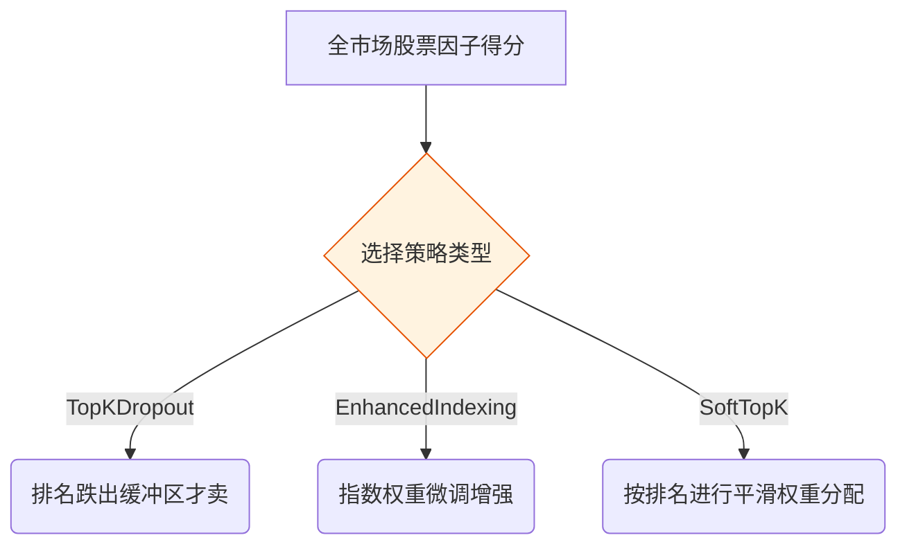

# 第 6 篇：回测与策略执行篇 —— 从纸上谈兵到真刀真枪

## 课程简介

经过前 5 篇的学习，我们手里终于攥着大模型挖出来并且通过了 IC 测试的“优质因子”了。

但是，知道哪只股票好是一回事，**怎么把钱分配给这些股票**又是另一回事。全仓买第一名？还是前 20 名平均买？大盘暴跌的时候还要硬扛吗？遇到涨停买不进、跌停卖不出怎么办？

本篇我们将深入解析 `runtime/config/backtest_rule.yaml`，看看本项目的 **组合层（Portfolio）** 和 **执行层（Execution）** 是如何逼真模拟真实世界的。

---

## 6.1 选股策略：有了因子分，怎么买？

系统支持 3 种主流的选股策略架构，你可以在 `backtest_rule.yaml` 中通过 `strategy_type` 切换。



### 策略 1：TopKDropout（宽幅缓冲策略，默认推荐）

**痛点**：如果你设定“永远只买排名前 20 的股票”。今天某只股票排第 20 被你买入，明天它变成了第 21 名，系统就会无情地把它卖掉。后天它又变回 20 名，系统又买回来。这种**高频换手**会产生巨额的手续费，把你的利润全部吃光！

**TopKDropout 的聪明解法**：买的时候要求高，卖的时候放宽容度！

```yaml
TopKDropout:
  buy_top_n: 40       # 优先买排名前 40 的
  sell_drop_to: 200   # 只要它没跌出前 200 名，就一直拿着！
  holding_count: 20   # 最终目标持仓 20 只
  weight_mode: equal_weight # 等权持仓，每只分配 1/20 的资金
```

### 策略 2：EnhancedIndexing（指数增强）

**痛点**：机构资金体量庞大，不能随便偏离大盘。老板的要求是：“你得跟着沪深300走，但每年要比它多赚 5%。”

**解法**：以真实的沪深300成分股权重为基底（比如贵州茅台占 3%）。如果因子的得分高，就把茅台的权重“倾斜”到 3.5%；如果得分低，就降到 2.5%。在不大幅偏离基准的情况下，悄悄赚取超额收益（Alpha）。

### 策略 3：SoftTopK（软性平滑权重）

**痛点**：排第 1 名的股票和排第 20 名的股票，信心程度是不一样的，如果平分资金（等权）显得不够聪明。

**解法**：按排名进行平滑衰减。第一名分配 8% 资金，第二名 7%，第二十名可能只分配 1%。
```yaml
SoftTopK:
  weight_func: softmax       # 权重分配算法
  holding_count: 30          # 买前 30 只
  softmax_temperature: 0.7   # 参数越小，越重仓前几名；参数越大，越接近平均分配
```

---

## 6.2 仓位管理与择时过滤（Market Timing）

倾巢之下，安有完卵。大盘发生系统性崩盘时，再好的因子也会跟着跌。所以我们需要一个“保护伞”。

在 `backtest_rule.yaml` 中，有一个专门的 `MarketTiming` 模块：

```yaml
MarketTiming:
  enabled: true             # 开启择时保护
  market_indicator: EMA_60  # 看大盘 60 日均线
  reduce_to: 0.6            # 如果大盘跌破均线，总仓位强制降到 60%（留 40% 现金防守）
  
  stock_open_filter: rsi    # 个股开仓过滤：用 RSI 指标
  rsi_buy_max: 70.0         # 如果这只股票近期 RSI > 70（已经涨得太高了，超买），坚决不建新仓去接盘！
```

**业务逻辑**：这是叠在主策略上面的“风控层”。主策略告诉你买什么，风控层决定**总共买多少**，以及**拦住那些涨得太疯的个股**。

---

## 6.3 交易执行与摩擦成本（Execution）

为什么很多人的策略在“纸上回测”时每年翻倍，一到实盘就亏成狗？
因为真实世界里有**手续费**、有**滑点**、还有**中国特色的涨跌停板**！

本项目在 `Execution` 模块中进行了极其逼真的模拟：

```yaml
Execution:
  initial_cash: 1000000   # 初始资金 100 万
  
  # 交易价格：用次日开盘价！
  # 为什么不用当天的收盘价？因为你在盘中计算因子需要时间，当你算出结果时当天已经收盘了，你根本买不进去！只能第二天一早买。
  trade_price: next_open

  # 摩擦成本（中国 A 股标准费率）
  buy_cost: 0.0015        # 买入佣金 千分之1.5
  sell_cost: 0.0025       # 卖出佣金 千分之2.5
  stamp_duty: 0.001       # 卖出还要交印花税 千分之1
  slippage: 0.0005        # 滑点：模拟买的时候价格不小心被拉高了，卖的时候被砸低了
  
  cash_buffer_ratio: 0.02 # 预留 2% 资金防止手续费不够导致下单失败

  # 中国特色机制处理
  suspend_action: skip        # 停牌：没法交易，直接跳过
  limit_up_action: skip_buy   # 涨停买入：跳过，买不进去就不买了
  limit_down_action: delay_sell # 跌停卖出：今天卖不掉？明天继续挂单重试，直到卖出去为止！
```

> 💡 **核心避坑指南**：
> 特别注意 `limit_down_action: delay_sell`。很多业余回测软件在跌停时会按跌停价“假装”卖出去了，导致回测净值虚高。本项目严格模拟了“跌停关门跑不掉”的残酷现实，这才是负责任的量化态度！

---

### 小结

在这一篇中，我们完成了从“因子分”到“真金白银”的跨越：
1. 我们学习了 3 种组合策略，特别是为了降低换手率而巧妙设计的 **TopKDropout** 机制。
2. 我们懂得了如何用 **MarketTiming** 在熊市中自保。
3. 我们看到了 **Execution** 模块是如何死磕细节，逼真模拟滑点、印花税以及涨跌停机制的。

经历过这套严酷考验的因子，基本可以确信能在实盘中生存了。
但是，我们怎么证明这套策略不是“过拟合”（恰好碰上了过去某段好行情）呢？
在下一篇**《第 7 篇：评估迭代与第三方校验篇》**中，我们将学习如何用“盲测”和“聚宽导出”来做最终的大考！
